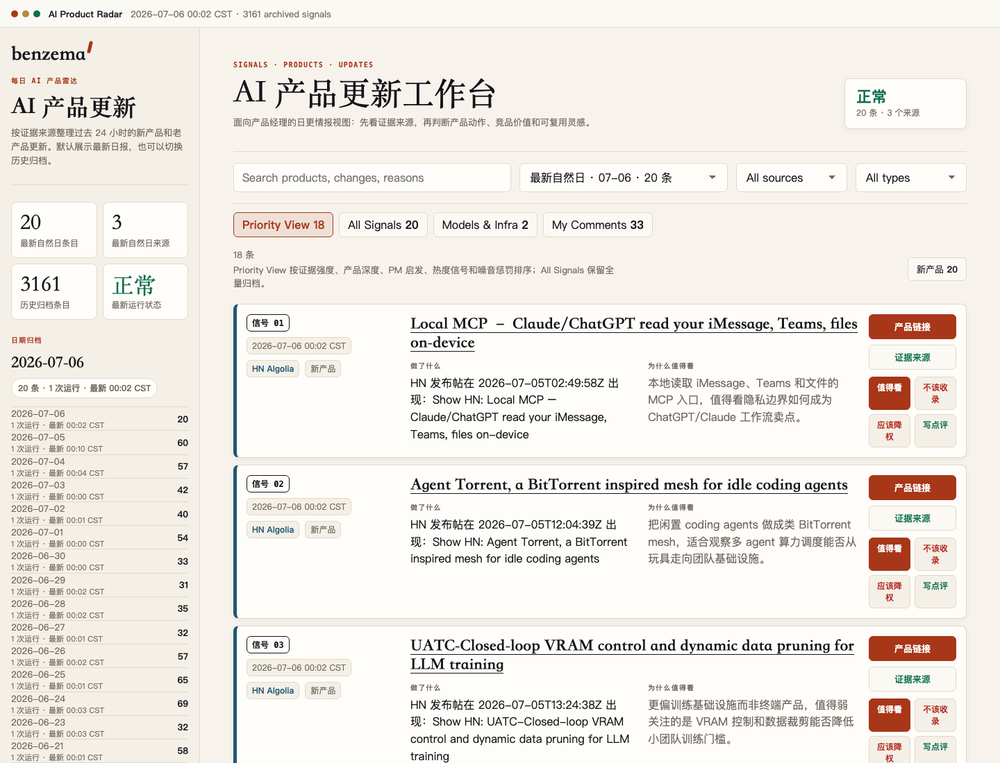
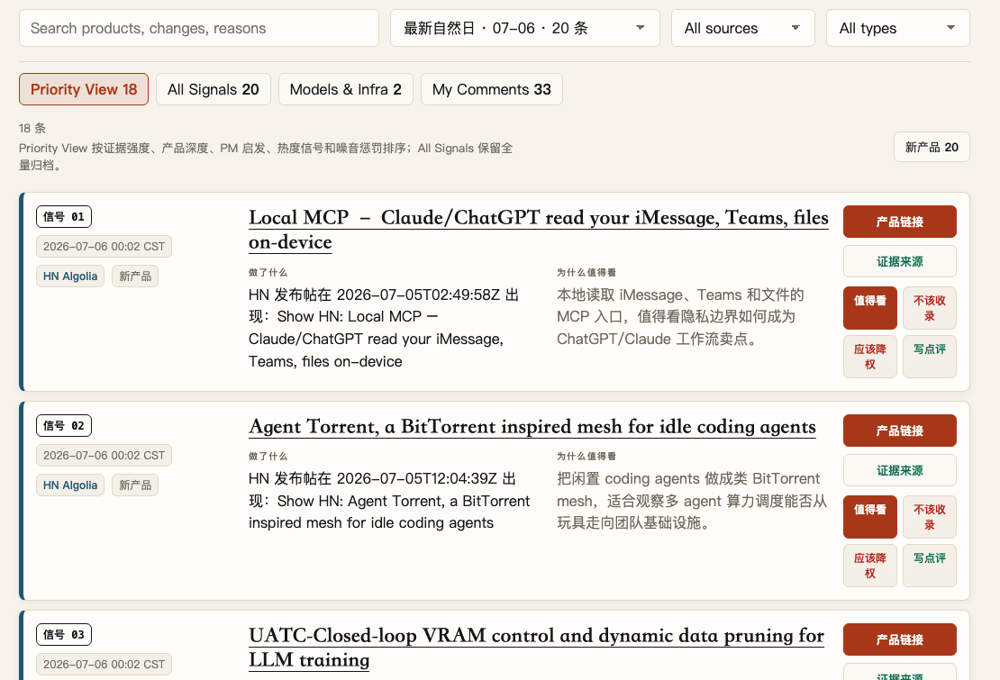
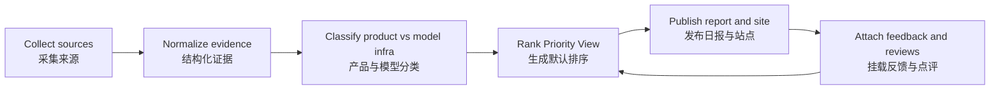

# AI Product Radar / AI 产品雷达

[](https://github.com/BENZEMA216/ai-product-radar/stargazers)
[](https://github.com/BENZEMA216/ai-product-radar/commits/main)
[](https://benzema216.github.io/ai-product-radar/)

[Live dashboard](https://benzema216.github.io/ai-product-radar/) · [Daily reports](./reports) · [Quality design](./docs/radar-quality-design.md) · [Acceptance contract](./docs/radar-quality-acceptance.md)

> 中文：面向 AI 产品经理的每日产品雷达。它把过去 24 小时里值得看的 AI 新产品、老产品更新、模型与基础设施动态汇总到一个可反馈、可复盘、可持续优化的工作台里。
>
> English: A daily AI product radar for product managers who track launches, competitors, product patterns, and reusable inspiration.

AI Product Radar is an open-source daily AI product discovery and competitive-intelligence dashboard. It watches Product Hunt, Hacker News, GitHub Releases, Hugging Face, YC Launch, AIHOT, and best-effort China-market signals, then turns noisy launch streams into a ranked, reviewable product radar for AI product managers.

AI 产品雷达是一个开源的 AI 产品发现与竞品监控工作台。它每天追踪 Product Hunt、Hacker News、GitHub Release、Hugging Face、YC Launch、AIHOT 以及国内产品信号，把分散的新产品发布、老产品更新、模型与基础设施变化整理成可排序、可点评、可复盘的产品情报。



## Why It Exists / 为什么做

| English | 中文 |
| --- | --- |
| Product managers need more than a news feed. They need evidence, ranking, product-level reasoning, and a feedback loop. | 产品经理不只是需要新闻流，而是需要证据、排序、产品级判断，以及能每天反馈和改进的闭环。 |
| The radar keeps the raw archive broad, then builds a sharper Priority View for daily reading. | Radar 尽量保留全量归档，同时给日常阅读提供更聚焦的 Priority View。 |
| Every item can be reviewed, dropped, downranked, or annotated so tomorrow's radar learns from today's judgment. | 每个产品都可以被标记为值得看、不该收录、应该降权或写点评，让第二天的结果吸收今天的判断。 |

## What You See / 你会看到什么

| View | What it is | 中文说明 |
| --- | --- | --- |
| Priority View | Ranked products with stronger evidence, product depth, PM value, heat signals, and noise penalties. | 默认优先视图，综合证据强度、产品深度、PM 启发、热度信号与噪音惩罚排序。 |
| All Signals | The broader daily archive, useful when you want recall over precision. | 全量信号归档，适合想尽可能多看、不想过早筛掉内容的时候。 |
| Models & Infra | Hugging Face and infra/model-level changes separated from product launches. | 模型和基础设施单独成类，避免和面向用户的产品混在一起。 |
| My Comments | Your product comments attached back to the product card. | 你的每日点评会挂回对应产品，后续可以复盘。 |



## Use Cases / 使用场景

| Use case | English | 中文 |
| --- | --- | --- |
| AI product discovery | Find new AI tools, agent products, model launches, and workflow products every day. | 每天发现新的 AI 工具、Agent 产品、模型发布和工作流产品。 |
| Competitive intelligence | Watch how AI startups package, position, launch, and update their products. | 观察 AI 创业公司如何包装、定位、发布和更新产品。 |
| Product inspiration | Extract reusable product patterns from launch copy, feature updates, and community reactions. | 从发布文案、功能更新和社区反馈里提取可复用的产品灵感。 |
| PM review workflow | Attach daily comments to product cards and let feedback improve tomorrow's ranking. | 把每日点评挂到产品卡片上，让反馈影响第二天排序。 |

## Search Keywords / 搜索关键词

English keywords: AI product radar, AI product discovery, AI competitive intelligence, AI tools, AI agents, MCP products, Product Hunt AI launches, Hacker News Show HN AI, Hugging Face model updates, startup discovery, product management workflow, daily AI report.

中文关键词：AI 产品雷达、AI 产品发现、AI 竞品监控、AI 产品经理、AI 工具发现、Agent 产品、MCP 产品、Product Hunt AI 新品、Hacker News AI 产品、Hugging Face 模型更新、AI 创业公司、每日 AI 产品报告。

## Source Coverage / 信息来源

| Source | Role | Quality rule |
| --- | --- | --- |
| Product Hunt | Launch discovery and market-facing positioning. | Uses the Pacific completed daily leaderboard where available; records rank, votes, comments, and fallback health. |
| Hacker News | Show HN / Launch HN products and developer adoption signals. | Keeps launch-like product signals; filters news, essays, directories, and weak AI evidence. |
| hcker.news | High-signal AI essays and engineering blogs for Knowledge Radar. | Uses the public AI/external-link feed with an HN score floor, then keeps the canonical article URL and filters launches, repositories, papers, inaccessible pages, and shallow news. |
| GitHub Release | Product and infra updates with concrete releases. | Uses release evidence, avoids generic training/search noise, and limits repeated repo dominance. |
| Hugging Face | Models, datasets, spaces, and infra changes. | Routes model-heavy items into Models & Infra instead of the main product feed. |
| AIHOT / YC Launch | Structured AI product and startup launch sources. | Requires time evidence and product-level relevance. |
| Dealflow / XHS | China-market and social product signals when available. | Attempts by default; records an explainable zero when bridge/login/source access is unavailable. |

## How It Works / 工作流



## Prompt Pack / 提示词

Copy these when you want to review the radar, leave product comments, or improve filtering.

### Daily Product Review / 每日产品点评

```text
请基于今天的 AI Product Radar，帮我逐个看 Priority View 里的产品。

输出要求：
1. 保留我的表达风格，不要改成媒体稿。
2. 每条点评 attach 到对应产品。
3. 对不该收录、应该降权、值得看、需要继续观察的产品分别标记。
4. 如果一个产品让我觉得“昨天已经见过”或“不是 AI 产品”，请明确写出原因，作为后续过滤规则的反馈。
```

### Ranking Audit / 排序检查

```text
请检查今天 Priority View Top 20 的排序质量。

重点看：
1. 是否有非 AI、低价值 novelty、目录/资源列表、旧产品重复出现。
2. Product Hunt 产品是否因为来源顺序被抬高，而不是因为 rank/votes/comments 或产品深度。
3. 同一个 GitHub repo 或 Hugging Face owner 是否刷屏。
4. 哪些产品应该上调，哪些应该降权，并写出可执行的规则修改建议。
```

### Feedback Issue / 反馈格式

```text
action: drop | downrank | keep | review
productKey: <产品链接或站内 productKey>
reportDate: YYYY-MM-DD
reason: <为什么不该收录、为什么应该降权、为什么值得看，或我的点评>
```

### English Review Prompt

```text
Review today's AI Product Radar as a product manager.

For each top-ranked item, decide whether it should be kept, dropped, downranked, or reviewed.
Keep the reasoning product-specific: who it serves, what changed, why it matters, and what reusable product pattern it reveals.
Call out duplicate launches, weak AI relevance, and products that look like old signals resurfacing.
```

## Quality Contract / 质量约束

- The latest public site is built from `reports/`, `quality/`, and `reviews/`.
- Product Hunt must prefer API data when `PRODUCT_HUNT_TOKEN` exists, otherwise the fallback must expose raw coverage and risk flags.
- Reports must ship with same-day `source-health`, `feedback`, `audit`, and `ranking` files.
- The "why it matters" column should be rewritten with product-specific reasoning before formal publish, not left as a repeated rule template.
- Feedback actions are intentionally small: `keep`, `drop`, `downrank`, `review`.
- Every open or closed radar-feedback Issue must be covered by `quality/feedback-policy.json`: either as a reusable rule or an explicitly justified exact-only judgment.
- Exact product feedback overrides generalized rules. Missing GitHub stars never become zero; Product Hunt engagement uses API votes when available and the completed Pacific daily rank as an explicit fallback proxy.
- GitHub Pages serves from `main /docs`; `docs/.nojekyll` is required so the static site and assets publish correctly.

## Run Locally / 本地运行

```bash
npm run smoke
npm run daily -- --hours 24
npm run build-site
npm run acceptance
```

```bash
python3 -m http.server 8787 --bind 127.0.0.1
open http://127.0.0.1:8787/docs/index.html
```

## Repository Map / 仓库结构

| Path | Purpose |
| --- | --- |
| `radar.mjs` | Source collectors, normalization, scoring, and JSON output. |
| `daily-runner.mjs` | Daily report generation and persistence. |
| `build-site.mjs` | Static GitHub Pages dashboard builder. |
| `quality-audit.mjs` | Acceptance checks, ranking audits, and quality artifacts. |
| `feedback-runner.mjs` | Turns GitHub feedback issues into attached product reviews and quality memory. |
| `feedback-policy.mjs` | Validates exhaustive Issue coverage and applies reusable feedback rules. |
| `reports/` | Daily markdown reports. |
| `quality/` | Source health, feedback snapshots, feedback policy, audits, and ranking diagnostics. |
| `reviews/` | Product-attached user reviews. |
| `docs/` | Public dashboard served by GitHub Pages. |

## Links / 链接

- Public dashboard: [benzema216.github.io/ai-product-radar](https://benzema216.github.io/ai-product-radar/)
- GitHub repository: [BENZEMA216/ai-product-radar](https://github.com/BENZEMA216/ai-product-radar)
- Quality design document: [docs/radar-quality-design.md](./docs/radar-quality-design.md)
- Acceptance document: [docs/radar-quality-acceptance.md](./docs/radar-quality-acceptance.md)
