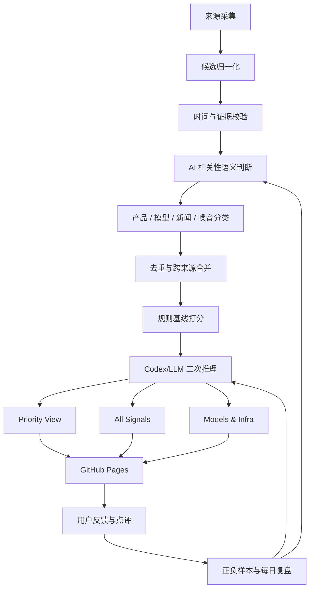

# 每日 AI 产品雷达：采集、筛选、排序与反馈闭环设计文档

最后更新：2026-06-08 CST

## 1. 背景

当前“每日 AI 产品雷达”已经能稳定生成日报和 GitHub Pages 站点，但质量上还有两个核心问题：

1. **漏产品**：重要 AI 产品发布或老产品更新没有被发现。
2. **坏产品排前面**：低信号、非 AI、娱乐 novelty、薄 wrapper 或证据不足的产品进入默认首屏。

这份文档定义下一版雷达的产品级设计。目标不是把报告变小，而是把“广覆盖”和“默认排序可信”拆开：保留尽可能多的信号，同时让默认视图更像一个 AI 产品经理每天可以直接看的优先级列表。

## 2. 目标与非目标

### 2.1 目标

- 尽可能覆盖过去一天内的新 AI 产品、老产品更新和重要模型/基础设施变化。
- 明确区分“产品信号”和“模型/技术信号”，避免 Hugging Face 模型变化和产品发布混在一起。
- 用证据、语义相关性、产品深度、热度和 PM 启发价值做默认排序，而不是靠来源权重和关键词加分。
- 让用户能在网页上快速反馈“值得看 / 不该收录 / 应该降权 / 我的点评”。
- 自动化任务每天读取用户反馈，把负样本、正样本和点评带入第二天的筛选、排序和复盘。

### 2.2 非目标

- 不追求替代 Product Hunt、HN、GitHub、Hugging Face 的完整数据库。
- 不让 LLM 编造没有来源证据的产品事实。
- 不把所有 AI 相关内容都放到默认首屏；弱信号可以保留在 All Signals，但不应该抢占 Priority View。
- 不做周报式汇总；用户只需要每日视角。

## 3. 总体架构



核心原则：

- **采集阶段宽一点**：宁可多拿候选，不在 fetch/parser 层过度筛掉。
- **证据阶段硬一点**：结构化来源必须有发布时间或来源日期规则；模糊日期只能进弱信号或待确认。
- **语义阶段聪明一点**：不能再用字符子串判断 AI，例如 `trainer`、`campaigns` 不应该因为包含连续字母 `ai` 被误收。
- **排序阶段产品经理化**：默认排序回答“我今天先看什么”，不是回答“哪个来源基础分高”。
- **反馈阶段可闭环**：用户点一次“不该收录”，第二天必须能被系统读到，并进入负样本或降权逻辑。

## 4. 信息源设计

### 4.1 Product Hunt

Product Hunt 是首日产品发布的重要来源，但当前实现只通过 Jina Reader 读 daily leaderboard，再用 OrangeBot fallback。这不够完整，因为：

- Jina Reader 可能只返回页面摘要，不保证覆盖完整榜单。
- Product Hunt 页面本身可能对直接抓取返回 403。
- OrangeBot 覆盖更全，但不是一手来源，不能作为唯一可信数据源。

下一版策略：

| 层级 | 数据源 | 作用 | 处理规则 |
|---|---|---|---|
| P0 | Product Hunt API v2 GraphQL | 主来源，拿 post/product、tagline、votes/comments、featuredAt、topics、makers、rank | 配置 `PRODUCT_HUNT_TOKEN` 后启用 |
| P1 | Product Hunt daily leaderboard 页面 | 官方页面 fallback | 仅用于 API 不可用时补充 |
| P2 | OrangeBot Product Hunt source | 覆盖率 fallback / audit source | 可补漏，但 evidence 必须标明为 fallback |
| P3 | Hunted.space 等历史页 | 人工审计辅助 | 不直接作为正式证据 |

日期规则：

- Product Hunt 官方帮助文档说明首页按 Pacific 时间的 24 小时周期刷新，午夜刷新。
- 我们的自动化在北京时间早上 08:00 或 11:00 跑时，Product Hunt 当天榜单仍处于 Pacific 当日进行中。
- 默认日报应抓取 **最近一个已经结束的 Pacific 日榜**，避免早上抓到半截榜单导致漏掉或第二天重复。
- 如果需要观察进行中的 PH 当日榜，应单独标记为 `in_progress_ph`，不和正式日报混为一个完成窗口。
- 如果同一个 Pacific 完成日榜已经在早前手动/正式报告中发布，后续日报默认不再补发该日榜的剩余 PH 产品；这类补漏只能进入显式“补漏报告”，不能混进今日日报。
- 同一北京时间自然日内的补跑属于对当天快照的替换，不属于跨日历史；PH 历史去重必须忽略当天较早报告，否则补跑会错误删除当天已发现的 PH 产品。
- PH 历史去重同时看产品链接和 PH 日榜日期。source health 中 `keptCount` 继续表示本次发现的 AI 相关 PH 候选数，`reportKeptCount` 表示历史去重后实际进入本次报告的 PH 条数，`previouslyReportedCount` 表示被已报道链接或已处理日榜过滤的数量，避免把“抓到了但去重未发布”误判成来源失败。

去重规则：

- 优先使用 Product Hunt post id。
- 没有 id 时使用 canonical product URL。
- 再降级为 normalized product name + PH date。
- 同一产品跨日重复出现时，正式日报只保留第一次完整收录；后续作为补充 evidence 或更新记录。

站点按北京时间自然日归档时，同一天存在多份补跑报告只保留时间最新的一份作为 canonical snapshot；历史报告仍保留在 Git 中用于审计，但不能把多次运行的行数和卡片直接相加。

### 4.2 Hacker News

用户提出“是不是只要 Launch HN，不要 Show HN”。设计结论：**两者都保留，但权重和筛选不同**。

理由：

- `Launch HN` 通常是 YC 公司正式发布，成熟度和公司信号更强。
- `Show HN` 覆盖大量独立开发者、开源工具、AI agent、devtool、MCP、workflow 产品。只保留 Launch HN 会漏掉很多早期但有启发的产品。

下一版策略：

| 子来源 | 默认处理 | 筛选强度 | 排序倾向 |
|---|---|---|---|
| Launch HN | 保留 | 中等 | 高置信来源 |
| Show HN | 保留 | 严格 | 需要语义命中产品和 AI，不靠标题子串 |
| 普通 HN story | 默认不进入产品页 | 严格 | 只进入 All Signals 或新闻/观点区 |

实现方向：

- 继续用 Algolia 做时间窗口搜索和关键词召回。
- 对候选 story 再用 HN 官方 item API hydrate `score`、`descendants`、`time`、`url`。
- HN 的 `score/comments` 是热度信号，但不是唯一排序依据。
- `Show HN` 标题中没有明确 AI 证据时，必须从正文 URL、标题和 comment context 中找到语义证据，否则降级或排除。

### 4.3 GitHub

用户明确倾向：**默认产品报告只保留 GitHub Release，不需要 GitHub Trending 混进来**。

设计结论：

- Product Report 默认只收 GitHub Release，尤其是固定 watchlist 中的 AI 工具、agent 框架、MCP、workflow、LLM infra 项目。
- GitHub Trending/Search 可以作为“召回审计源”和“候选池”，但不直接进入默认产品列表。
- 如果 Trending 项目确实是新产品发布，必须通过 release、README、repo creation/update、外部 launch evidence 做二次确认。

### 4.4 Hugging Face

当前 Hugging Face 噪音高，主要原因是模型、Space、实验项目混在同一个产品列表里。

下一版拆分：

| 类型 | 放置位置 | 收录规则 |
|---|---|---|
| Spaces | Product / All Signals | 有可体验产品、demo、应用形态时进入产品信号 |
| Models | Models & Infra Tab | 作为模型/基础设施变化，不和产品 launch 混排 |
| Datasets | 默认不收 | 除非与重要产品或模型发布强绑定 |
| Organization official release | Product 或 Models & Infra | 根据内容归类 |

默认首屏不应该被 HF 模型更新占据，但模型变化对 AI 产品经理仍有价值，所以单独做 Tab。

### 4.5 AIHOT

AIHOT 是重要聚合源，能补充社媒、官方博客、X/Twitter、公司动态和中文语境。

规则：

- AIHOT 可以作为 discovery source。
- 如果 AIHOT 指向的是官方发布、产品页、GitHub、PH、X/Twitter 原帖，应尽量把 evidence 升级到一手链接。
- 如果只有 AIHOT 摘要且没有明确产品动作，进入 All Signals 或弱信号，不进入 Priority View 前列。

### 4.6 YC Launch

YC Launch 保留为高置信来源。

规则：

- 必须在时间窗口内。
- 必须语义上与 AI 产品、AI workflow、AI infra、AI-enabled SaaS 相关。
- 由于 YC Launch 公司的成熟度通常更高，默认排序可加来源置信度，但不能无条件压过更高价值的 HN/PH/GitHub 信号。

### 4.7 XHS / Dealflow

XHS 一般情况下默认启用，但它依赖本地 Dealflow bridge、Chrome 扩展和登录状态，所以要把“不可用”视为可解释降级。

规则：

- 默认尝试 XHS。
- bridge 不可用、未登录、搜索失败时，不判定日报失败，但 source health 必须记录。
- XHS 结果不直接凭关键词进入 Priority View；需要语义判断“是否是真产品、真实使用反馈或真实发布”。
- XHS 更适合补充国内产品语言、用户反馈、真实使用场景，不适合单独作为时间证据强来源。

### 4.8 公司官网 / 官方 Changelog

这是老产品更新的核心来源，优先级应该高于泛搜索。

第一批 watchlist 建议：

| 公司 / 产品 | 来源类型 | 关注内容 |
|---|---|---|
| OpenAI | Blog、release notes、docs changelog | 新模型、API、ChatGPT、Codex、agents |
| Anthropic | News、docs、model release | Claude、API、MCP、agent 能力 |
| Google DeepMind / Google AI | Blog、Gemini updates | Gemini、AI Studio、Vertex AI |
| Microsoft | AI blog、GitHub releases | Copilot、Azure AI、agent infra |
| Perplexity | Blog、product updates | search、browser、assistant workflow |
| Cursor / Anysphere | changelog、blog | coding agent、IDE workflow |
| Windsurf | changelog、blog | coding agent、IDE workflow |
| Runway | blog、product updates | video generation workflow |
| ElevenLabs | blog、docs changelog | voice agent、audio workflow |
| Midjourney | announcements | image/product workflow |
| Figma | release notes、blog | design AI、workflow |
| Notion | release notes、blog | workspace AI、agent/workflow |
| Canva | product updates | design AI、template workflow |
| Zapier / n8n / Make | changelog | automation、agent workflow |

国内官方来源后续单独建 watchlist，例如：阿里云/通义、腾讯混元、字节豆包/扣子、百度文心、月之暗面 Kimi、智谱、MiniMax、阶跃星辰、零一万物、商汤、百川、快手可灵、美图、秘塔、硅基流动等。

### 4.9 Knowledge Radar：Blog + 论文

Knowledge Radar 与产品日报分轨运行，避免研究、观点和技术文章污染产品 Top 20。它每天从官方研究/工程博客、可信独立作者和 Hugging Face Daily Papers / arXiv 中选择约 20 篇，发布到 `knowledge-reports/YYYY-MM-DD.md` 与 `docs/knowledge.html`。

默认规则：

- Blog 使用 7 天观察窗口并跨日按 canonical URL 去重；论文优先使用当天 Hugging Face Daily Papers 的社区筛选，再链接到 arXiv 原文。
- 默认目标为 14 篇 Blog + 6 篇论文，让工程经验、产品判断和行业背景占更大比重；Blog 正常来源可用时至少应有 12 篇，论文源可用时至少保留 6 篇。
- Blog 优先保证来源多样性，同一来源先取不超过 2 篇；只有达到 14 篇目标所需且候选质量仍合格时才允许补位。
- 不按来源名或发布时间直接判定“重要”。排序考虑证据密度、解释增量、决策价值、可迁移性和来源历史质量。
- 纯发布稿、融资新闻、SEO 教程、泛泛趋势预测和重复产品公告不应占据前排。
- 正式发布前，由当次 Codex 逐条把“核心信息”和“为什么值得读”改写成中文；只能依据标题、摘要和原文，不得编造论文结论或实验数字。
- 高质量内容不足时可以少于 20 篇，但必须在 `quality/knowledge-source-health/YYYY-MM-DD.json` 解释来源异常或候选不足；不能用低质量内容硬凑。

首批来源定义在 `quality/knowledge-sources.json`。Blog 与论文候选、来源健康和验收结果分别写入：

- `quality/knowledge-candidates/YYYY-MM-DD.json`
- `quality/knowledge-source-health/YYYY-MM-DD.json`
- `quality/knowledge-audits/YYYY-MM-DD.json`

## 5. 候选数据结构

所有来源最终归一化成统一 candidate：

```json
{
  "signalKey": "2026-06-07|Product Hunt|ejentum-reasoning-harness",
  "productKey": "ejentum-reasoning-harness",
  "product": "Ejentum - Reasoning Harness",
  "link": "https://www.producthunt.com/products/...",
  "source": "producthunt",
  "sourceKind": "product_launch",
  "category": "product",
  "type": "new_product",
  "did": "Stop your AI agent drifting, flattering, and fabricating.",
  "evidence": "Product Hunt daily leaderboard",
  "evidenceUrl": "https://www.producthunt.com/...",
  "evidenceTime": "2026-06-06T07:00:00.000Z",
  "sourceRank": 12,
  "metrics": {
    "votes": 124,
    "comments": 18,
    "hnScore": null,
    "githubStars": null
  },
  "aiRelevance": {
    "isAI": true,
    "confidence": 0.82,
    "evidence": ["agent", "fabricating"]
  },
  "quality": {
    "label": "keep",
    "pmScore": 4,
    "priorityScore": 73,
    "reason": "..."
  }
}
```

关键点：

- `evidenceTime` 是结构化时间证据；没有时只能用来源日期规则。
- `category` 至少包含 `product`、`model_infra`、`news_opinion`、`noise`。
- `quality` 可由规则先占位，再由 Codex/LLM 二次推理改写。
- 默认排序会先按质量和分数确定同一 repo/owner 的最佳代表项，再对后续重复 GitHub repo / Hugging Face owner 做多样性降权；Top 10 默认最多 1 条，Top 20 默认最多 2 条，其余保留在 All Signals 后段。

## 6. 筛选设计

### 6.1 四级标签

| 标签 | 含义 | 默认处理 |
|---|---|---|
| `keep` | 明确 AI 产品/更新，有 PM 观察价值 | 进入 Priority View 和 All Signals |
| `weak_keep` | AI 相关，但证据或产品深度较弱 | 进入 All Signals，Priority View 靠后 |
| `deprioritize` | AI 相关但价值低，如娱乐 novelty、薄 wrapper、重复 commodity 产品 | 默认不进前排，可在 All Signals 查看 |
| `drop` | 非 AI、旧内容、重复、新闻观点、无产品动作 | 不进入正式报告 |

### 6.2 AI 相关性

不能用单纯字符匹配判断 AI。下一版采用两阶段：

1. **宽召回规则**：关键词、来源类型、tag、topic、描述、URL、公司名。
2. **语义判断**：判断候选是否真实涉及 AI 能力、AI 工作流、模型、agent、MCP、LLM、自动化、生成式能力或 AI-enabled 产品。

语义判断输出：

```json
{
  "isAI": true,
  "confidence": 0.86,
  "matchedConcepts": ["agent reliability", "AI workflow"],
  "notAIReason": null
}
```

负样本必须长期保留：

- `codetyper`：非 AI，不能因为 `trainer` 中有 `ai` 被误收。
- `Redirectly`：非 AI，不能因为 `campaigns` 中有 `ai` 被误收。
- `Babymorph.ai`：AI 相关但低信号消费娱乐 novelty，不应该进入默认首屏。
- Product Hunt 上只有模糊 “image” 或 “video” 但无 AI 证据的产品，不能只靠视觉类词汇入榜。

### 6.3 产品动作判断

必须判断候选是否是“产品动作”：

- 新产品发布；
- 老产品功能更新；
- 新模型/基础设施发布；
- 可体验 demo / Space；
- 官方 changelog / release。

以下内容默认不进入产品列表：

- 融资、估值、采访、观点；
- 纯新闻，没有产品动作；
- 教程、prompt 列表、资源合集；
- 预告但未发布；
- 无时间证据的旧产品介绍。

## 7. 排序设计

当前来源基础分 + 命中关键词加分的排序要废弃。它解释不了“为什么一个没有热度的 PH 产品排第一”，也不能表达产品经理真正关心的价值。

下一版使用 `priorityScore`：

| 维度 | 权重 | 说明 |
|---|---:|---|
| 证据强度 | 20 | 一手来源、明确时间戳、产品页/官方发布可验证 |
| 产品深度 | 20 | 是否是真工作流、真实产品、可持续使用场景 |
| PM 启发价值 | 20 | 是否能启发定位、入口、分发、定价、UX、wedge、竞品策略 |
| 新颖度/更新强度 | 15 | 新产品、重要能力更新、生态变化 |
| 热度/社区信号 | 10 | PH votes/comments、HN score/comments、GitHub stars、XHS 互动 |
| 战略相关性 | 10 | agent、workflow、devtool、B2B SaaS、MCP、国内产品语言等 |
| 来源置信度 | 5 | 官方 > 结构化社区 > 聚合源 |
| 噪音惩罚 | 最多 -30 | novelty、非 AI、证据模糊、重复、新闻-only、低成熟度 |

默认排序规则：

1. `drop` 不展示。
2. `Priority View` 按 `priorityScore` 降序。
3. 同分时优先：更强证据 > 更高热度 > 更高 PM score > 更新更近。
4. `All Signals` 保留广覆盖，可按时间、来源、类型切换。
5. `Models & Infra` 单独排序，不与产品混排。

同一 GitHub repo 或 Hugging Face owner 的多条 release/model 信号只允许第一条进入默认前排；后续条目降为弱保留，留在 All Signals 或 Models & Infra 中查看，避免同一项目的多包 release 刷屏。

## 8. Codex/LLM 的职责

脚本阶段可以生成占位文案，但正式日报发布前必须由 Codex/LLM 逐条推理：

```json
{
  "label": "keep",
  "pmScore": 4,
  "priorityScore": 76,
  "why": "这个产品把 agent 可靠性包装成企业可理解的控制层，值得看它如何把技术问题转成采购语言。",
  "evidenceGaps": [],
  "rankingReason": "证据清晰，产品问题明确，但热度一般，所以不应无条件排第一。"
}
```

约束：

- LLM 只能基于 candidate、evidence snippet、链接标题、来源元数据做判断。
- LLM 不得创造没有证据的融资、用户量、发布时间或产品能力。
- 如果证据不足，应该写 `evidenceGaps` 并降级。
- “为什么值得看”必须是产品经理语言，不能是来源模板，例如“在 PH 上把 AI 能力包装成可试用产品”这种重复句式。

## 9. 用户反馈与点评设计

### 9.1 网页按钮

每个产品卡片增加轻量反馈区：

| 按钮 | 含义 | 后续处理 |
|---|---|---|
| 值得看 | 用户认为应该保留或升权 | 进入正样本 |
| 不该收录 | 用户认为应 drop | 进入负样本，第二天复查 |
| 应该降权 | 用户认为可收录但不该排前面 | 更新降权样本 |
| 写点评 | 给当前产品 attach 用户点评 | 写入 review 数据 |

“漏掉产品”不挂在单个产品卡片上，避免把漏项反馈错误 attach 到某个已有产品。后续如果需要漏项入口，应做成日报级独立入口，并单独设计字段。

### 9.2 静态站点实现方式

当前网站是 GitHub Pages 静态站。第一版不引入数据库，使用 GitHub Issue 作为反馈入口：

- 点击按钮打开预填好的 GitHub Issue。
- Issue body 自动带上 `reportDate`、`signalKey`、`productKey`、`source`、`action`。
- 用户可以补一句理由或点评。
- 每日 automation 读取全部 radar-feedback issues，包括 open 和 closed，避免用户关闭 Issue 后反馈从学习链路消失；反馈写入 repo 中的结构化文件，字段不完整或 action 非法的 issue 必须进入 `invalidFeedback`，不能静默丢失。
- `action=review` 的反馈必须额外生成或合并到 `reviews/<reportDate>.json`，让点评 attach 到对应产品卡片，而不是只停留在 feedback 快照里。

后续如果需要更顺滑，可以再上轻量后端或 GitHub App，但第一版应该先用 GitHub 原生能力闭环。

### 9.3 反馈学习策略

Issue 不能只对原产品做精确匹配。每日 automation 必须先读取最新反馈快照，再由 Codex/LLM 基于用户原话更新 `quality/feedback-policy.json`。

每条 Issue 必须进入以下两类之一：

1. **可泛化规则**：反馈包含明确、可验证的判断条件，例如 GitHub star、Product Hunt votes、来源、产品类别、版本更新强度或稳定语义特征。
2. **仅精确命中**：反馈只说明当前产品重复、看不懂或主观不喜欢，无法安全推广到同类产品。必须记录 Issue 编号和不泛化原因，原产品仍由精确 `productKey` 反馈处理。

不允许忽略 Issue，也不允许把单条模糊意见直接扩大成整类产品的永久 drop。

策略文件的核心结构：

```json
{
  "schemaVersion": 1,
  "generatedAt": "2026-07-24T15:59:57Z",
  "sourceIssueNumbers": [1, 2, 3],
  "rules": [
    {
      "id": "hn-github-stars-below-50-drop",
      "action": "drop",
      "scoreDelta": -30,
      "rationale": "用户明确要求 HN 中 star 少于 50 的个人 GitHub 项目不进入日报。",
      "issueNumbers": [2, 3],
      "match": {
        "sources": ["HN Algolia"],
        "linkHosts": ["github.com"],
        "githubStarsMax": 49
      }
    }
  ],
  "exactOnly": [
    {
      "issueNumber": 1,
      "reason": "只涉及当前产品重复，历史链接去重已经处理。"
    }
  ]
}
```

支持的规则条件包括：

- 来源、source subtype、产品类别和新旧类型；
- 链接域名和路径；
- 产品名、动作描述、证据文本中的 `anyTerms` / `allTerms` / `noneTerms`；
- GitHub star 区间或 star 证据不可用；
- Product Hunt 互动层级：官方 API 可用时依据 votes；fallback 不提供 votes 时依据 Pacific 已完成日榜 rank，不能伪造票数；
- 是否为只有版本号、发布通道或依赖包 patch 的弱 Release。

执行优先级：

1. 用户对当前产品的最新精确反馈；
2. 正负 golden 样本；
3. `feedback-policy` 通用规则；
4. 系统基础筛选和排序。

因此，用户后来对某个低 star 产品明确标记“值得看”时，具体反馈可以覆盖通用低 star 规则；通用规则不会误杀已经被用户明确认可的例外。

GitHub 链接在排序前通过 GraphQL 批量补充 star/fork 数据。接口不可用时必须把指标标为缺失，不能把缺失伪装成 0 star；缺失时可以降权，但不能执行依赖具体 star 上限的 drop 规则。

Product Hunt 的反馈采用同样的证据边界：官方 API 返回 votes 时，`0-9` 视为 `very_low`、`10-24` 视为 `low`；fallback 页面没有 votes 时，只使用已完成日榜的数字 rank 作为代理，`rank >= 50` 视为 `very_low`、`rank >= 20` 视为 `low`。缺少 votes 和 rank 时为 `unknown`，不能命中低互动 drop/downrank 规则。

每日 `quality/source-health/YYYY-MM-DD.json` 必须记录：

- GitHub metrics 请求数、成功补充数和状态；
- feedback policy 的 Issue 数、规则数、精确命中数、规则命中数和 drop 数；
- 每条规则当天的 matched / selected / dropped 数。

### 9.4 点评 attach 规则

点评 attach 到产品，不 attach 到页面位置。

主键：

- `productKey`：跨日报识别同一产品；
- `signalKey`：识别某一天某个来源的信号；
- `reportDate`：识别该次日报上下文。

点评文件：

```json
{
  "date": "2026-06-07",
  "productKey": "ejentum-reasoning-harness",
  "signalKey": "2026-06-07|Product Hunt|ejentum-reasoning-harness",
  "commentary": "我觉得这个点其实没那么大，agent 可靠性是问题，但它的包装不一定能撑起一个企业采购理由。",
  "tone": "preserve_user_voice",
  "reviewNextDay": true
}
```

### 9.5 次日复盘

次日复盘不是给用户做周报，而是做三个具体动作：

1. 昨天你标记“不该收录”的产品，今天是否又被收进来了？
2. 昨天你写的点评，今天是否改变了排序或同类产品判断？
3. 昨天漏掉的产品，是来源没覆盖、parser 漏、时间规则错，还是筛选/排序错？

复盘输出不需要长篇总结，只需要在后台形成结构化审计，并在必要时给出一句“今天修正了什么”。

## 10. 数据文件设计

下一版建议新增：

| 文件 | 用途 |
|---|---|
| `quality/source-registry.json` | 定义来源、权重、预期 count 区间、失败模式 |
| `quality/company-watchlist.json` | 公司官网、blog、changelog、RSS watchlist |
| `quality/goldens/negative-products.json` | 用户和测试确认的负样本 |
| `quality/goldens/positive-products.json` | 用户认可的高价值样本 |
| `quality/audits/YYYY-MM-DD.json` | 每日精准率、排序、召回审计 |
| `quality/source-health/YYYY-MM-DD.json` | 每日来源状态 |
| `quality/feedback/YYYY-MM-DD.json` | 从 GitHub Issues 读取的反馈 |
| `quality/feedback-policy.json` | Codex 从全部 Issue 归纳的可审计筛选与排序规则 |
| `quality/ranking/YYYY-MM-DD.json` | Top-k 排序评分和指标 |
| `reviews/YYYY-MM-DD.json` | 用户点评与次日复盘，按产品 attach 到站点 |

## 11. 发布视图设计

网站默认展示：

1. **Priority View**：产品经理优先看什么。
2. **All Signals**：广覆盖，保留尽可能多的候选。
3. **Models & Infra**：模型、HF、LLM infra、benchmark、开源模型。
4. **My Comments**：用户点评过的产品和次日复盘。
5. **Source Health**：每个来源今天是否正常，为什么某来源是 0。

默认首屏只展示 Priority View，并且每条都要能解释“为什么排在这里”。

## 12. 外部依据

- Product Hunt 官方 API v2 文档：<https://www.producthunt.com/v2/docs>
- Product Hunt 帮助中心说明首页按 Pacific 时间 24 小时周期刷新：<https://help.producthunt.com/en/articles/2305333-getting-started>
- Hacker News 官方 API：<https://github.com/HackerNews/API>
- GitHub Releases REST API：<https://docs.github.com/en/rest/releases>
- Hugging Face Hub API：<https://huggingface.co/docs/hub/api>
- Hugging Face Hub 搜索/list 文档：<https://huggingface.co/docs/huggingface_hub/v0.20.1/guides/search>

## 13. 开放决策

需要和用户确认的决策：

1. Product Hunt 是否配置官方 API token。如果不配置，就只能把 OrangeBot/Jina 作为可解释 fallback，覆盖率无法完全保证。
2. `Priority View` 是否允许只展示 `keep` 和高分 `weak_keep`，低信号项目默认只在 All Signals。
3. 用户反馈第一版是否接受 GitHub Issue 跳转式交互，而不是站内直接写入。
4. HF 模型 Tab 是否每天都展示，还是只在模型变化达到一定重要性时展示。

## 14. 实施顺序建议

1. 建立数据结构和质量标签，不先改 UI。
2. 接入 Product Hunt 官方 API 或把 fallback 覆盖审计做清楚。
3. 重构 HN、GitHub、HF 的分类策略。
4. 加入 `priorityScore` 和 Codex/LLM 二次推理要求。
5. 增加用户反馈按钮和 GitHub Issue 读取链路。
6. 增加每日验收脚本和质量报告。
7. 再改站点默认视图和 Tabs。
